- [Report](#Report)
- [tests](#tests)
    - [flake8](#flake8)
    - [pytest](#pytest)
- [circleci](#circleci)
- [Github-Merge](#Github-Merge)
- [Questions](#Questions)

# Report

I started with creating a Repo and creating a "Dev" branch and installed flake8 + pytest
```python
Py -m pip install flake8
Py -m pip install pytest
```
I created a basic python code that are easy to make tests for

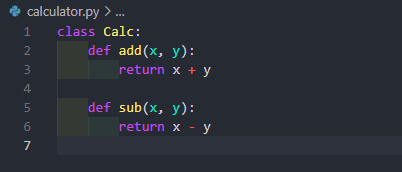


## tests
After that I created a test_calculator.py to test my code

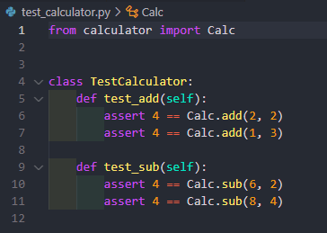

by running these commands in the terminal 
```python
Py -m pip flake8 --statistics
Py -m pip pytest
```
# **flake8**

showed two tests where one failed and one succeeded.

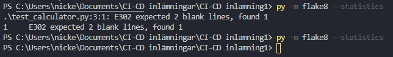

# **pytest**

Two tests here aswell.

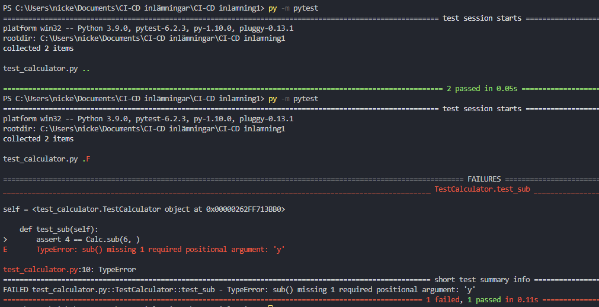

## circleci

I added a .circleci with a config.yml file to automate the tests to run whenever I push to any branch.

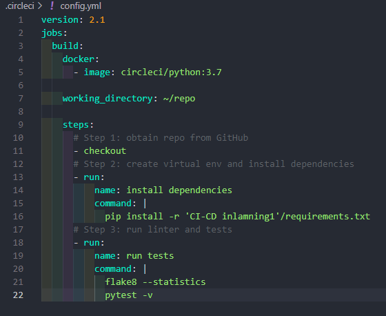

I ran the command "py -m pip freeze > requirements.txt" in the terminal and cleaned up the file from everything that wont be needed for these tests

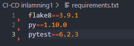

Here I can see the different builds and this one passed.

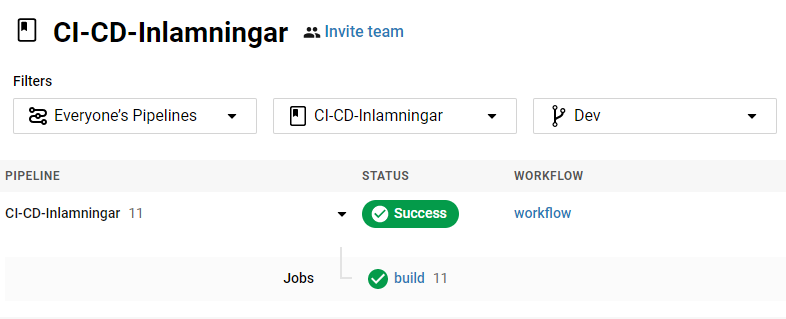

And in this part I can see all the steps and what circleci did.

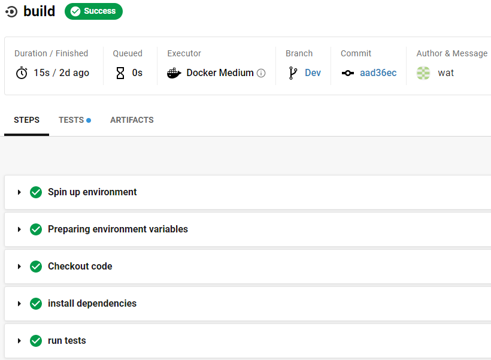

## Github Merge

Open a pull request from Tests to Master

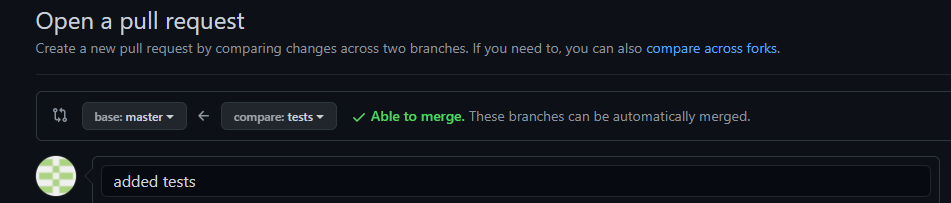


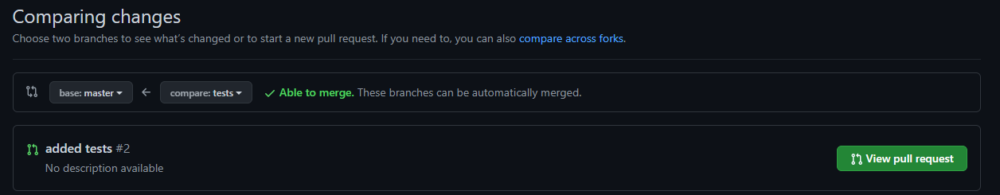

Here I see that all the tests went through and I am therefor able to merge

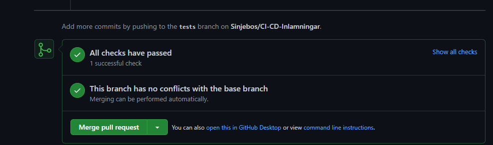


## **Questions**

1. [x] The tools I used during the assignment
 - Github
 - Circleci
 - Yml
 - VSC
2. [x] How I used the tools to complete the assignment

3. [x] If I encountered any problems and how I solved them
 - I put my Circleci directory outside of the actuall directory and encountered the problem where it could not find the files to tests and solved it by redirecting the command that runs the tests (I did this for eventuall further assignments).

4. [x] Describe how the tests worked and how I used them in the assignment.
 - My tests shows that my code works and are accepted to be merged into Master branch
 - checks that 2+2 = 4 which is false ;) 

5. [x] Whats missing for reaching CD
 - The missing could be auto merging the branches from DEV to Master if the tests are accepted and code is working fine. 